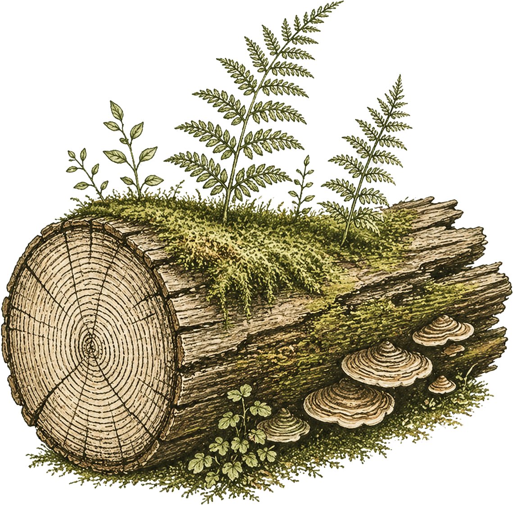

# Understory: The Living Timeline

**A multi-layer temporal canvas for mapping how factors across different domains have unfolded and intersected over time.**



**[→ Open the app](https://centrinnovations.github.io/understory/)**

---

Understory is an open-source browser-based tool built on Peter Taylor's concept of *unruly complexity* — the idea that the conditions shaping any phenomenon are distributed across domains, unfold at different rates, and rarely reduce to a single cause or timeline.

Where conventional timelines flatten history into a single thread, Understory lets you build **layered, connected, annotated temporal maps** — showing not just what happened, but in which domain, at what rate, and in relationship to what else.

---

## What It's For

Understory is designed for researchers, educators, and practitioners who need to:

- Map how policy, community, institutional, and cultural factors have **co-evolved** over time
- Surface relationships and intersections that single-domain narratives obscure
- Build a shared temporal structure before analysis begins — as a **facilitation and sense-making tool**
- Document the historical context of a partnership, program, or field

It is particularly useful in community-engaged research contexts where the history of a place, relationship, or initiative spans multiple systems with different rhythms and logics.

---

## Features

- **Multiple layers** — define named rows for different domains (policy, community, institutional, technological, etc.)
- **Freeform event placement** — click anywhere on the canvas to place and label an event
- **Event connections** — draw curved, directional links between events across layers with custom line styles and colors
- **Column annotations** — shade and label periods or phases across the full canvas
- **Trend bands** — add horizontal markers spanning a time range to show sustained conditions or pressures
- **Drag to reposition** — move events freely after placement
- **Export** — save your timeline as JSON (to reload later), PNG, or PDF

## Getting Started

### Try it locally

```bash
git clone https://github.com/CEnTRInnovations/understory.git
cd understory
npm install
npm run dev
```

Then open [http://localhost:5173/understory/](http://localhost:5173/understory/) in your browser.

## The Name

In forest ecology, the *understory* is the layer of vegetation that grows beneath the forest canopy — often overlooked, but essential to the health and complexity of the ecosystem. It is where many of the most intricate relationships between species play out, away from the dominant view.

The name reflects what this tool is designed to surface: the layers of context, condition, and history that shape phenomena from below — the parts of a story that don't make it into the headline timeline but without which the headline makes no sense.

## Conceptual Grounding

Understory is grounded in Peter Taylor's framework of *unruly complexity*, which holds that social and ecological phenomena are shaped by heterogeneous conditions distributed unevenly across scales, domains, and time. Taylor's method of *intersecting processes mapping* asks researchers to identify the strands that have come together to produce a situation — and to trace each strand back through its own history.

Understory provides a visual workspace for that kind of mapping, making the multi-strand structure legible without forcing premature synthesis.

## Part of the CEnTR Ecosystem

Understory is one of several open tools developed by [CEnTRInnovations](https://centrinnovations.github.io) to support community-engaged scholarship:

| Tool | Purpose |
|------|---------|
| **[Apiary](https://centrinnovations.github.io/hexagons/)** | Hexagonal sensemaking canvas for concept clustering |
| **[Understory](https://centrinnovations.github.io/understory/)** | Multi-layer temporal canvas for complexity mapping |
| **CEnTR\*SEEK** | Identifies community-engaged work across institutional text |
| **CEnTR\*MAP** | Asset-based documentation of community partnerships |
| **CEnTR\*IMPACT** | Scholarly credit and cascade impact profiling |

## License

MIT License. See [LICENSE](LICENSE) for details.

---

*Developed by [CEnTRInnovations](https://centrinnovations.github.io).*